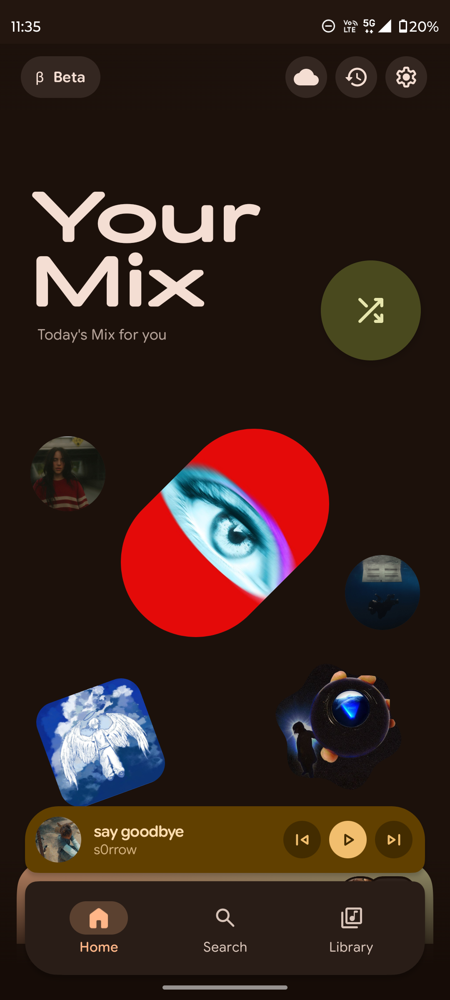
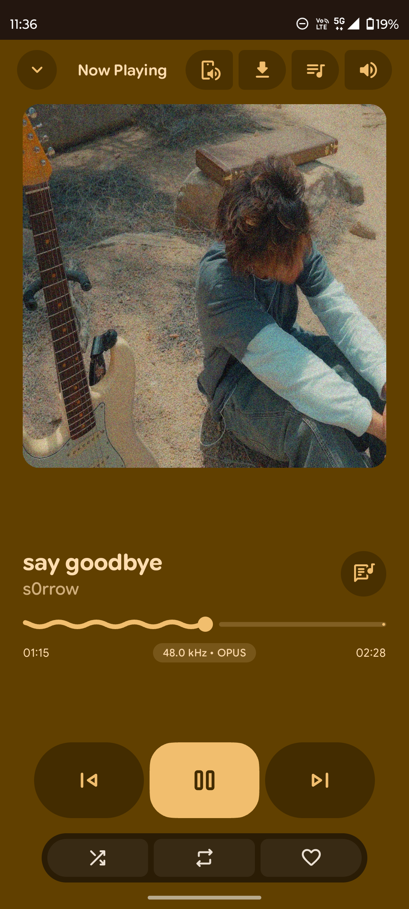
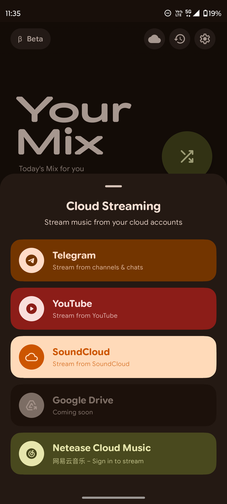
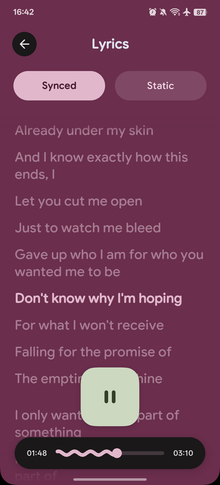

<div align="center">

# 🎵 PixelTune

**Your music, everywhere — local files, cloud drives, and the world's biggest
streaming catalogs, in one expressive player for Android.**

[](./LICENSE)
[](https://github.com/Saineeee/PixelTune/releases)
[](https://developer.android.com)
[](https://kotlinlang.org)
[](./CONTRIBUTING.md)

<!-- Screenshot note: replace the images below with fresh PixelTune captures
     before release if assets/ still shows the original PixelPlay branding. -->
| Home | Player | Cloud Catalog | Library |
|:---:|:---:|:---:|:---:|
|  |  |  |  |

**[Download](#-download--install) · [Features](#-features) · [Build from source](#️-building-from-source) · [FAQ](#-faq--troubleshooting) · [Contributing](#-contributing)**

</div>

---

## 📖 About

PixelTune is a **Material 3 Expressive** music player for Android that treats
*your* music as the center of the experience. Your local library stays
first-class — synced live from your storage with a full folder explorer —
while your own cloud sources (Google Drive, Telegram channels) stream through
a personal on-device proxy, exactly as you arranged them.

On top of that foundation, PixelTune adds what most local players are missing:
instant access to the **YouTube Music, YouTube and SoundCloud catalogs**, an
**offline downloads** system, and **cross-service playlist import** from
Spotify, Apple Music and YouTube — all inside the same polished, fully
themeable interface, with a Wear OS companion, Android Auto, Cast and
home-screen widgets.

> [!NOTE]
> PixelTune is a community fork of
> [PixelPlayer](https://github.com/PixelPlayerHQ/PixelPlayer) (v0.6.0-beta
> base, MIT-licensed era), extended with an original streaming and cloud-catalog
> layer. See [Credits & attribution](#-credits--attribution) and
> [THIRD_PARTY_NOTICES.md](./THIRD_PARTY_NOTICES.md).

## ✨ Features

### What PixelTune adds

- 📡 **YouTube Music & YouTube streaming** — search the entire catalog and
  play instantly, no account or API key required. Extraction is powered by
  [NewPipeExtractor](https://github.com/TeamNewPipe/NewPipeExtractor); streams
  are routed through a local [Ktor](https://ktor.io) proxy so ExoPlayer gets a
  clean, stable HTTP source with proper seeking and range support.
- 🔊 **SoundCloud streaming** — the same instant-play experience for
  SoundCloud tracks, surfaced in search and the Cloud Catalog.
- 🧭 **Cloud Catalog** — a unified browsing surface for online playlists and
  artists: real cover art, uploader info, track counts, online/offline filter
  chips, and seamless infinite pagination. Everything is playable without
  leaving the app or shuffling between services.
- ⬇️ **Offline downloads** — download any streaming track for offline
  listening. Files are stored in private app storage (no storage permission
  creep), progress is surfaced through notifications, and a dedicated
  Downloads library keeps them organized.
- 📥 **Playlist import with preview** — paste a playlist URL from
  **Spotify, Apple Music or YouTube**, and PixelTune resolves each track to
  YouTube using fuzzy title/artist matching (Jaccard-based scoring). A preview
  screen lists every candidate match with a *reason chip*, so you can swap or
  drop mismatches **before** anything is committed to your library.
- And many more minor improvements throughout the app.

### Core features (inherited from the PixelPlayer base)

| Area | Highlights |
|---|---|
| 💾 **Local library** | MediaStore sync with a live change observer, folder explorer, paging for very large libraries |
| ☁️ **Your cloud, your music** | Google Drive and Telegram channel streaming through a personal on-device proxy ([TDLib](https://core.telegram.org/tdlib) 1.8.56) |
| 🀄 **NetEase Cloud Music** | Built-in NetEase integration |
| 🤖 **AI playlists & metadata** | Generate playlists and metadata with Gemini or DeepSeek |
| 🎨 **Material 3 Expressive UI** | Dynamic palettes, album-art theming, carousel styles, navigation-bar customization |
| 🎼 **Lyrics** | Synced lyrics via LrcLib with source preferences |
| 🎚️ **Audio engine** | Equalizer with presets, ReplayGain, custom crossfade and transition rules |
| 🧪 **Smart tools** | Mashup, Quick Fill and Daily Mix |
| 📊 **Playback stats** | Engagement tracking, recently played, listening history |
| 💾 **Backup & restore** | Module-based, validated local backups |
| 🏷️ **Tag editor** | Edit metadata for your local files |
| 📱 **Everywhere** | Wear OS companion, Android Auto, Cast, Quick Settings tiles, sleep timer |

## 📲 Download & install

Grab the latest APK from the
[**Releases**](https://github.com/Saineeee/PixelTune/releases) page.

### Requirements

| | |
|---|---|
| **Phone** | Android 10 (API 29) or newer |
| **Wear OS** | Wear OS 3+ (separate APK, ships alongside) |
| **Storage access** | Granted on first launch for the local library |

### Install steps

1. Download the APK for your device (`app` for phone, `wear` for Wear OS).
2. If prompted, allow *Install unknown apps* for your browser or file manager.
3. Open the APK and confirm the install.
4. On first launch, grant storage access and let the initial library sync run.

> [!IMPORTANT]
> PixelTune is in **beta**. Expect rough edges — please report them in
> [Issues](https://github.com/Saineeee/PixelTune/issues) so they can be fixed
> quickly.

## 🛠️ Building from source

### Prerequisites

| Tool | Version | Notes |
|---|---|---|
| Android Studio | Latest stable | Recommended IDE |
| JDK | 21 | Auto-provisioned by the Gradle toolchain |
| Gradle | 8.13 | Via the included wrapper — no manual install |
| Android SDK | API 35 | `compileSdk = 35`, `targetSdk = 35` |

### Steps

```bash
git clone https://github.com/Saineeee/PixelTune.git
cd PixelTune
./gradlew :app:assembleDebug      # debug build (phone)
./gradlew :wear:assembleDebug     # debug build (Wear OS)
./gradlew :app:assembleRelease    # release build (minified)
./gradlew :app:testDebugUnitTest  # unit tests
```

### Project structure

| Module | Purpose |
|---|---|
| `:app` | Phone application (UI, data, playback engine) |
| `:wear` | Wear OS companion application |
| `:shared` | Models and payloads shared between phone and Wear |
| `:baselineprofile` | Startup and scrolling benchmark profiles |

### Repository layout

```text
PixelTune/
├── app/                                  # Phone application — main module
│   └── src/
│       ├── main/
│       │   ├── java/com/theveloper/pixeltune/
│       │   │   ├── data/                 # Data layer
│       │   │   │   ├── ai/               #   AI playlist providers (Gemini, DeepSeek)
│       │   │   │   ├── backup/           #   Module-based backup & restore
│       │   │   │   ├── database/         #   Room database, entities & DAOs
│       │   │   │   ├── downloads/        #   Offline download manager
│       │   │   │   ├── gdrive/           #   Google Drive streaming
│       │   │   │   ├── github/           #   Release announcements & contributors
│       │   │   │   ├── media/            #   MediaStore sync & library indexing
│       │   │   │   ├── netease/          #   NetEase Cloud Music integration
│       │   │   │   ├── network/          #   OkHttp stack, IPv4-preferred DNS
│       │   │   │   ├── playlist/         #   Cross-service playlist import
│       │   │   │   ├── preferences/      #   DataStore settings repository
│       │   │   │   ├── repository/       #   Repository implementations
│       │   │   │   ├── service/          #   Playback engine, MediaSession, Cast, Auto
│       │   │   │   ├── soundcloud/       #   SoundCloud streaming
│       │   │   │   ├── stats/            #   Playback stats & engagement
│       │   │   │   ├── stream/           #   On-device Ktor streaming proxy
│       │   │   │   ├── telegram/         #   Telegram channel streaming (TDLib)
│       │   │   │   ├── worker/           #   Background library-sync workers
│       │   │   │   ├── youtube/          #   NewPipeExtractor integration
│       │   │   │   └── …                 #   model/, paging/, image/, equalizer/, …
│       │   │   ├── di/                   # Hilt dependency-injection modules
│       │   │   ├── presentation/         # Compose UI layer
│       │   │   │   ├── components/       #   Reusable composables & bottom sheets
│       │   │   │   ├── navigation/       #   Navigation graph
│       │   │   │   ├── screens/          #   Feature screens (player, library, …)
│       │   │   │   ├── viewmodel/        #   ViewModels & state holders
│       │   │   │   └── …                 #   library/, gdrive/, netease/, telegram/
│       │   │   ├── ui/                   # Theme & design system
│       │   │   └── utils/                # Helpers (metadata, queue, artwork cache…)
│       │   ├── res/                      # Strings, themes, widget & shortcut XMLs
│       │   └── AndroidManifest.xml
│       ├── debug/                        # Debug-only resources & network config
│       ├── benchmark/                    # Startup macrobenchmarks
│       └── test/                         # JVM unit tests
├── wear/                                 # Wear OS companion (Wear OS 3+)
├── shared/                               # Phone ↔ Wear models (Wear* DTOs, intents)
├── baselineprofile/                      # Baseline-profile generation module
├── gradle/
│   └── libs.versions.toml                # Version catalog — single source of versions
├── remote-config/
│   └── app-announcements.properties      # Remote announcement toggles (fetched at runtime)
├── assets/                               # README screenshots
├── build.gradle.kts                      # Root build script
├── settings.gradle.kts                   # Module declarations
├── gradle.properties                     # App version (APP_VERSION_NAME / APP_VERSION_CODE)
├── CHANGELOG.md                          # Release history
├── LICENSE                               # GPL-3.0 (+ MIT attribution header)
├── THIRD_PARTY_NOTICES.md                # Third-party licenses & preserved MIT notice
└── README.md                             # This file
```


### Tech stack

| Layer | Technology |
|---|---|
| Language | Kotlin 2.1, Coroutines, kotlinx.serialization, kotlinx.collections.immutable |
| UI | Jetpack Compose (Material 3 Expressive), Glance widgets |
| Media | Media3 / ExoPlayer, on-device Ktor streaming proxy |
| Data | Room, DataStore, WorkManager |
| DI | Hilt |
| Streaming | NewPipeExtractor (YouTube / SoundCloud), TDLib (Telegram) |
| Network | OkHttp, Ktor client |
| Images | Coil |

## 📌 Project status

PixelTune is under active development and currently in **beta**. The streaming
and cloud layers are new and evolving quickly; APIs may change between beta
releases. Breaking changes will be called out in the
[changelog](https://github.com/Saineeee/PixelTune/blob/master/CHANGELOG.md).
Stability reports — especially from devices the maintainer doesn't own — are
the most valuable contributions right now.

## 🤝 Contributing

Contributions are welcome, in every form:

- 🐛 **Bug reports** — open an [issue](https://github.com/Saineeee/PixelTune/issues)
  with your device, Android version, and steps to reproduce. Crash logs are gold.
- 💡 **Feature ideas** — start a discussion or issue describing the problem
  you're solving before the implementation.
- 🔧 **Pull requests** — fork, create a feature branch, and keep changes
  focused. Kotlin + Compose conventions apply; match the surrounding code
  style. Make sure `./gradlew :app:testDebugUnitTest` passes before opening
  the PR.
- 🌍 **Translations** — string resources live in
  `app/src/main/res/values/strings.xml` (and per-locale `values-*/` folders);
  new locales are very welcome.

## ❓ FAQ & troubleshooting

**Is an account required?**
No. PixelTune has no accounts and no server. You connect *your own* cloud
sources (Google Drive, Telegram) and the streaming catalogs are accessed
directly from the public platforms.

**Where does streaming content come from?**
From third-party public platforms (YouTube, SoundCloud, NetEase) via their
public interfaces. PixelTune hosts nothing — see the
[disclaimer](#️-disclaimer).

**The install is blocked ("unknown apps").**
Android blocks sideloaded APKs by default. Allow *Install unknown apps* for
the app you downloaded with (browser/file manager), then retry.

**Streaming stutters on mobile data.**
Lower the streaming quality preference in Settings → Playback, and check that
battery optimization isn't throttling the app in the background.

**Playlists from Spotify import with some mismatches.**
Expected — the importer matches by title/artist similarity, and Spotify
metadata sometimes differs from YouTube's. Use the preview screen's reason
chips to review and swap candidates before saving.

**My library scan misses files.**
Check Settings → Folders to confirm the containing directory is included, and
that the files are visible in MediaStore (reboot or re-mount storage if they
were added while the device was off).

## 🙏 Credits & attribution

PixelTune would not exist without:

- **[PixelPlayer](https://github.com/PixelPlayerHQ/PixelPlayer)** by
  [Theo Vilardo](https://github.com/theovilardo) — the foundation PixelTune is
  built on. Portions of this codebase are based on PixelPlayer's
  MIT-licensed snapshot and remain under MIT (see
  [THIRD_PARTY_NOTICES.md](./THIRD_PARTY_NOTICES.md)). Thank you for the
  incredible base.
- **[NewPipeExtractor](https://github.com/TeamNewPipe/NewPipeExtractor)** —
  powering the YouTube / SoundCloud integration
- **[TDLib](https://core.telegram.org/tdlib)** and the
  [tdlib-x](https://github.com/tdlib-x) packaging — Telegram channel streaming
- The **AndroidX, Kotlin, Material and Compose** teams, and every library
  author listed in [THIRD_PARTY_NOTICES.md](./THIRD_PARTY_NOTICES.md)
- Every contributor and tester who files issues, sends logs, and patiently
  reports what breaks

## 📄 License

PixelTune is licensed under the **GNU General Public License v3.0** — see
[LICENSE](./LICENSE).

In plain terms: you are free to use, study, modify and redistribute PixelTune,
including in your own builds — but derivative works must remain free software
under GPL-3.0, with source made available.

Portions of the codebase derived from PixelPlayer's pre-May-2026 MIT-licensed
snapshot remain governed by that MIT license; the required notices are
preserved in [THIRD_PARTY_NOTICES.md](./THIRD_PARTY_NOTICES.md), which also
covers the bundled third-party libraries and their licenses.

## ⚠️ Disclaimer

PixelTune does **not** host, own or distribute any media content. All streaming
content is provided by third-party public platforms and belongs to its
respective owners. This project is not affiliated with, endorsed by, or
sponsored by YouTube, Google, Spotify, Apple, SoundCloud, NetEase, Telegram or
GitHub. Streaming features are intended for personal use; please respect the
terms of service of the platforms you access and support the artists you love.
