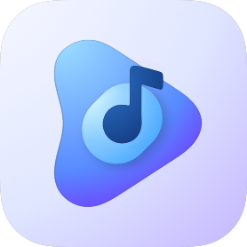
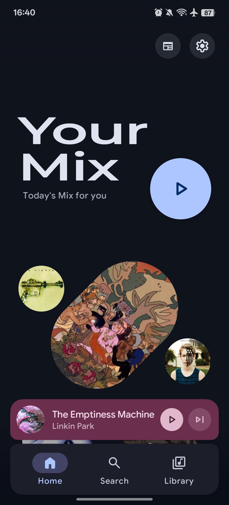
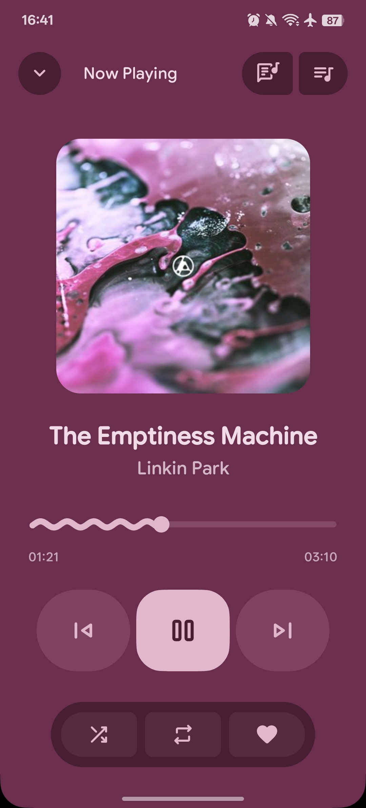
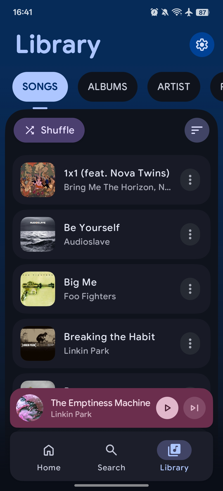

# PixelTune 🎵

<p align="center">
  
</p>

<p align="center">
  <strong>A next-generation, multi-source music player for Android</strong><br>
  Built with Jetpack Compose, Material Design 3, and powered by AI
</p>

<p align="center">
  
  
  
  
</p>

<p align="center">
    <a href="https://github.com/Saineeee/PixelTune/releases/latest">
        
    </a>
    
    
    
</p>

---

## 📖 Overview

**PixelTune** is a powerful, feature-rich music player for Android that goes beyond traditional local playback. It unifies your music experience by supporting **multiple audio sources** — from your local library to streaming services like **YouTube**, **SoundCloud**, **NetEase Cloud Music**, **Telegram**, and **Google Drive** — all within a single, beautifully crafted interface.

Originally evolved from the PixelPlayer project, PixelTune introduces groundbreaking features like multi-source streaming, a 10-band equalizer, AI-powered playlist generation, Wear OS companion support, and Android Auto integration.

---

## ✨ Features

### 🌐 Multi-Source Music Streaming
PixelTune breaks the boundaries of traditional music players by integrating multiple audio sources:

| Source | Description |
|--------|-------------|
| **📁 Local Library** | Full support for MP3, FLAC, AAC, OGG, WAV, Opus, and more |
| **▶️ YouTube** | Stream audio directly via NewPipe Extractor with local proxy |
| **💬 Telegram** | Play music from your Telegram chats and channels via TDLib |
| **☁️ Google Drive** | Stream your cloud music library with Google Sign-In |
| **🔊 SoundCloud** | Discover and stream from SoundCloud's vast catalog |
| **🎵 NetEase Cloud Music** | Access NetEase's extensive Chinese music library |

### 🎨 Modern UI/UX
- **Material 3 Expressive** — Dynamic color theming that adapts to your wallpaper with expressive motion
- **Smooth Animations** — Fluid transitions, micro-interactions, and tab animations
- **Customizable UI** — Adjustable corner radius, navigation bar settings, and palette styles
- **Dark/Light Theme** — Automatic or manual theme switching
- **Album Art Colors** — Dynamic color extraction from album artwork
- **Landscape Mode** — Full support for tablet and landscape orientations

### 🎵 Powerful Playback
- **Media3 ExoPlayer** — Industry-leading audio engine with FFmpeg support
- **Background Playback** — Full media session integration with foreground service
- **Queue Management** — Drag-and-drop reordering with animated scrolling
- **Shuffle & Repeat** — All playback modes supported
- **Gapless Playback** — Seamless transitions between tracks
- **Crossfade** — Customizable crossfade between songs
- **Custom Transitions** — Configure per-playlist transition effects
- **Floating Quick Player** — Instant preview player for local files

### 🎚️ 10-Band Equalizer & Audio Effects
- **10-Band Graphic Equalizer** — Fine-tune your sound across the frequency spectrum
- **Preset Management** — Built-in and custom EQ presets
- **Audio Effects Suite** — Comprehensive sound enhancement tools

### 🤖 AI-Powered Features
- **AI Playlist Generation** — Create smart playlists using Google Gemini with customizable prompts and model selection
- **Daily Mix** — AI-powered personalized playlist based on your listening habits
- **Your Mix** — Smart, diverse selections tailored to your taste

### 📚 Library Management
- **Multi-format Support** — MP3, FLAC, AAC, OGG, WAV, Opus, M4A, and more
- **Browse By** — Songs, Albums, Artists, Genres, Folders
- **Smart Artist Parsing** — Configurable delimiters for multi-artist tracks
- **Album Artist Grouping** — Proper album organization
- **Folder Filtering** — Choose which directories to scan
- **Tree-Style Navigator** — Hierarchical folder exploration
- **M3U Playlist Import/Export** — Standard playlist format support

### 🔍 Discovery & Organization
- **Full-text Search** — Search across your entire library and connected sources
- **Playlists** — Create and manage custom playlists with custom covers
- **Statistics** — Rich listening history, session insights, and habit tracking
- **Recently Played** — Quick access to your listening history

### 🎤 Lyrics
- **Synchronized Lyrics** — LRC format via LRCLIB API and NetEase integration
- **Lyrics Editing** — Modify or add lyrics to your tracks
- **Sync Offset** — Adjustable timing offset for perfect sync
- **Multi-Strategy Search** — Intelligent lyrics discovery across sources
- **Scrolling Display** — Follow along as you listen

### 🖼️ Artist Artwork
- **Deezer Integration** — Automatic artist images from Deezer API
- **Smart Caching** — Memory (LRU) + database caching for offline access
- **Fallback Icons** — Beautiful placeholders when images unavailable

### 📝 Metadata Editing
- **Tag Editor** — Edit metadata with multiple backends:
  - **TagLib** — MP3, FLAC, M4A support
  - **JAudioTagger** — Fallback for complex ID3 frames
  - **VorbisJava** — Opus/Ogg metadata editing

### 📲 Connectivity & Casting
- **Chromecast** — Stream to your TV or smart speakers
- **Android Auto** — Full in-car playback support
- **Wear OS** — Companion app for wrist-based control
- **Widgets** — Home screen control with Glance widgets

### ⚙️ Advanced Features
- **Baseline Profiles** — Optimized app startup and runtime performance
- **Audio Waveforms** — Visual representation with Amplituda
- **Device Capabilities** — Hardware capability detection and optimization
- **Remote Config** — Dynamic app announcements and configuration

---

## 🛠️ Tech Stack

| Category | Technology |
|----------|------------|
| **Language** | [Kotlin](https://kotlinlang.org/) 100% |
| **UI Framework** | [Jetpack Compose](https://developer.android.com/jetpack/compose) |
| **Design System** | [Material Design 3](https://m3.material.io/) |
| **Audio Engine** | [Media3 ExoPlayer](https://developer.android.com/guide/topics/media/media3) + FFmpeg |
| **Architecture** | MVVM with StateFlow/SharedFlow |
| **DI** | [Hilt](https://dagger.dev/hilt/) |
| **Database** | [Room](https://developer.android.com/training/data-storage/room) |
| **Networking** | [Retrofit](https://square.github.io/retrofit/) + OkHttp + Ktor (HTTP Server) |
| **Image Loading** | [Coil](https://coil-kt.github.io/coil/) |
| **Async** | Kotlin Coroutines & Flow |
| **Background Tasks** | WorkManager |
| **Paging** | [Paging 3](https://developer.android.com/topic/libraries/architecture/paging/v3-overview) |
| **Widgets** | [Glance](https://developer.android.com/jetpack/compose/glance) |
| **Metadata** | TagLib + JAudioTagger + VorbisJava |
| **YouTube** | [NewPipe Extractor](https://github.com/TeamNewPipe/NewPipeExtractor) |
| **Telegram** | [TDLib](https://core.telegram.org/tdlib) |
| **AI** | [Google Gemini](https://ai.google.dev/) (google.genai) |
| **Wear OS** | [Play Services Wearable](https://developers.google.com/wear) |
| **Casting** | [Google Cast SDK](https://developers.google.com/cast) |

---

## 📱 Requirements

- **Android 10** (API 29) or higher
- **4GB RAM** recommended for smooth performance
- **Internet connection** for streaming features and AI functionality

---

## 🚀 Getting Started

### Prerequisites

- Android Studio Ladybug | 2024.2.1 or newer
- Android SDK 35
- JDK 11+

### Installation

1. **Clone the repository**
   ```sh
   git clone https://github.com/Saineeee/PixelTune.git
   cd PixelTune
   ```

2. **Open in Android Studio**
   - Open Android Studio
   - Select "Open an Existing Project"
   - Navigate to the cloned directory

3. **Sync and Build**
   - Wait for Gradle to sync dependencies
   - Build the project (`Build → Make Project`)

4. **Run**
   - Connect a device or start an emulator
   - Click Run (▶️)

---

## 📂 Project Structure

```
PixelTune/
├── app/                          # Main Android application
│   └── src/main/java/com/theveloper/pixeltune/
│       ├── data/
│       │   ├── ai/               # Gemini AI integration
│       │   ├── backup/           # Backup/restore functionality
│       │   ├── database/         # Room entities, DAOs, migrations
│       │   ├── equalizer/        # 10-band EQ and audio effects
│       │   ├── gdrive/           # Google Drive streaming
│       │   ├── github/           # GitHub API (updates)
│       │   ├── image/            # Image loading & caching
│       │   ├── media/            # Media session & playback
│       │   ├── model/            # Domain models
│       │   ├── netease/          # NetEase Cloud Music integration
│       │   ├── network/          # API services (LRCLIB, Deezer)
│       │   ├── observer/         # File system observers
│       │   ├── paging/           # Paging 3 implementations
│       │   ├── playlist/         # Playlist management
│       │   ├── preferences/      # DataStore preferences
│       │   ├── repository/       # Data repositories
│       │   ├── service/          # MusicService, HTTP server
│       │   ├── soundcloud/       # SoundCloud integration
│       │   ├── stats/            # Listening statistics
│       │   ├── stream/           # Generic streaming utilities
│       │   ├── telegram/         # Telegram TDLib integration
│       │   ├── worker/           # WorkManager sync workers
│       │   └── youtube/          # YouTube/NewPipe integration
│       ├── di/                   # Hilt dependency injection modules
│       ├── presentation/
│       │   ├── components/       # Reusable Compose components
│       │   ├── gdrive/           # Google Drive UI
│       │   ├── library/          # Library UI components
│       │   ├── navigation/       # Navigation graph
│       │   ├── netease/          # NetEase UI
│       │   ├── screens/          # Screen composables
│       │   ├── telegram/         # Telegram UI
│       │   ├── utils/            # Presentation utilities
│       │   └── viewmodel/        # ViewModels
│       ├── ui/
│       │   ├── glancewidget/     # Home screen widgets
│       │   └── theme/            # Colors, typography, theming
│       └── utils/                # Extensions and utilities
├── baselineprofile/              # Baseline Profile generator
├── remote-config/                # Remote configuration files
├── shared/                       # Shared module (Wear OS data layer)
└── wear/                         # Wear OS companion application
```

---

## 🗺️ Roadmap

- [x] Multi-source streaming (YouTube, Telegram, Drive, SoundCloud, NetEase)
- [x] 10-band Equalizer
- [x] AI Playlist Generation
- [x] Wear OS companion app
- [x] Android Auto support
- [x] Chromecast integration
- [x] Baseline Profiles
- [ ] Audio separation (Spleeter integration)
- [ ] Expanded Wear OS features
- [ ] Desktop/Web companion

---

## 🤝 Contributing

Contributions are welcome! Please feel free to submit a Pull Request.

1. Fork the Project
2. Create your Feature Branch (`git checkout -b feature/AmazingFeature`)
3. Commit your Changes (`git commit -m 'Add some AmazingFeature'`)
4. Push to the Branch (`git push origin feature/AmazingFeature`)
5. Open a Pull Request

---

## 📄 License

This project is licensed under the MIT License - see the [LICENSE](LICENSE) file for details.

---

## 🙏 Acknowledgments

- Original PixelPlayer foundation by [theovilardo](https://github.com/theovilardo)
- [NewPipe Extractor](https://github.com/TeamNewPipe/NewPipeExtractor) for YouTube streaming
- [TDLib](https://core.telegram.org/tdlib) for Telegram integration
- [LRCLIB](https://lrclib.net/) for synchronized lyrics
- [Deezer API](https://developers.deezer.com/) for artist artwork

---

<p align="center">
  Made with ❤️ by <a href="https://github.com/Saineeee">Saineeee</a> and contributors
</p>
